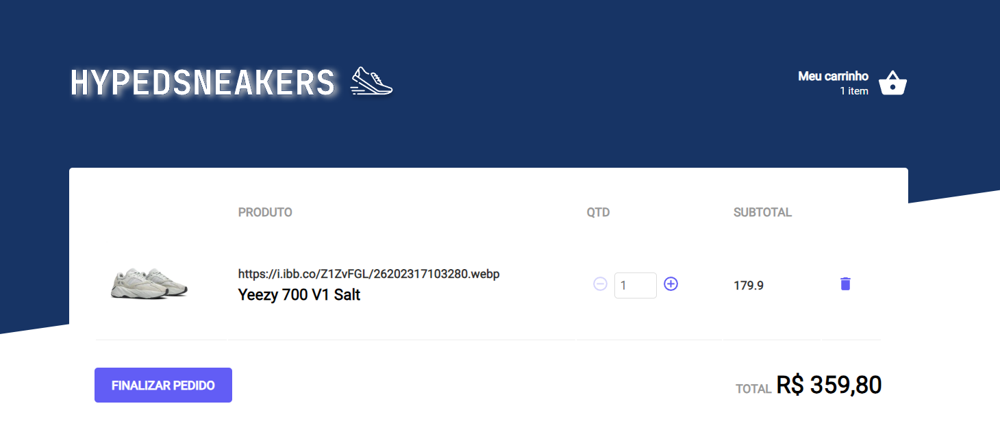

 

<h1 align="center"> 👟 HypedSneakers </h1>
<h3 align="center"> A shopping cart app using mainly React and TypeScript. </h3>

## ⚠️ What this project is about?

A sneakers shopping cart project made as a challenge for develop a better understanding of React and TypeScript rules.
This project is made with study purposes only, feel free to contribute.

## 🔍 What was learned here?

The main objective of this application was just to create a shopping cart hook that manages
it's products based on this rules:

- Add a new product to the cart;
- Remove a product from the cart;
- Change the quantity of a product in the cart;
- Calculation of the sub-total and total prices of the cart;
- Stock validation;
- Display of error messages using Toast notification;

I already had the base application to work on but i proposed myself as an extra challenge to create the application from zero, from the styles to the fake API using MirageJS. The fake API was used only to
save the fake shoes data like name, image, price and stock amount.
Each product has a different stock, so if the user pass that number an error message will be notified.

## 🛠️ Technologies

- <a href="https://reactjs.org/">React</a>
- <a href="https://www.typescriptlang.org/">TypeScript</a>
- <a href="https://miragejs.com/">MirageJS</a>
- <a href="https://developer.mozilla.org/en-US/docs/Web/API/Window/localStorage">LocalStorageAPI</a>

## 🚀 Project on execution

By accessing this link you can test the project, here you can: Add a product, add quantity to each product, see the item quantity of each different product change in your cart and remove a product from the cart.

-
